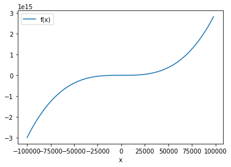
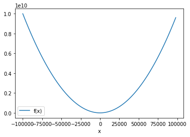
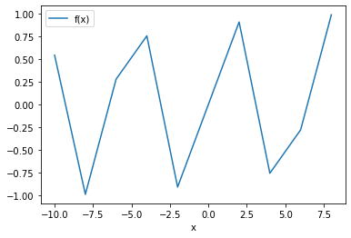

```python
import pandas as pd
import matplotlib.pyplot as plt
from utils.CSVGenerator import write_csv
from utils.config import MY_CONFIG
from utils.Interpolate import newton_forward, get_forward_table
from utils.Roots import bisection, newton_rhapson, regula_falsi, secant, csv_bisection, csv_newton_rhapson, csv_regula_falsi, csv_secant
import numpy as np
import mpld3
from ctypes import *
```


```python
def x_generator(n = None):
    return MY_CONFIG.LOWER_BOUND + (MY_CONFIG.INTERVAL * n)

def polynomial(x):
    return (3 * x**3 + x**2 - 4)

@write_csv(x_generator, polynomial)
def write(file_name):
    return
```


```python
write('cubic.csv')
```


```python
cubic = pd.read_csv(f'{MY_CONFIG.ROOT}/cubic.csv')
```


```python
cubic.plot(kind='line', x='x', y='f(x)')
```


    <AxesSubplot:xlabel='x'>


    

    


```python
write = write_csv(x_generator, lambda x : x**2)(write)
```


```python
write('parabola.csv')
```


```python
para = pd.read_csv(f'{MY_CONFIG.ROOT}/parabola.csv')
```


```python
para.plot(kind='line', x='x', y='f(x)')
```


    <AxesSubplot:xlabel='x'>


    

    


```python
from utils.Interpolate import get_forward_table, newton_forward
import numpy as np
```


```python
MY_CONFIG.NO_OF_COORDINATES = 10
MY_CONFIG.INTERVAL = 2
MY_CONFIG.LOWER_BOUND = -10
MY_CONFIG.UPPER_BOUND = 10
```


```python
write = write_csv(x_generator, np.sin)(write)
```


```python
write('sin.csv')
```


```python
sin = pd.read_csv(f'{MY_CONFIG.ROOT}/sin.csv')
```


```python
sin
```


<div>
<style scoped>
    .dataframe tbody tr th:only-of-type {
        vertical-align: middle;
    }

    .dataframe tbody tr th {
        vertical-align: top;
    }

    .dataframe thead th {
        text-align: right;
    }
</style>
<table border="1" class="dataframe">
  <thead>
    <tr style="text-align: right;">
      <th></th>
      <th>x</th>
      <th>f(x)</th>
    </tr>
  </thead>
  <tbody>
    <tr>
      <th>0</th>
      <td>-10</td>
      <td>0.544021</td>
    </tr>
    <tr>
      <th>1</th>
      <td>-8</td>
      <td>-0.989358</td>
    </tr>
    <tr>
      <th>2</th>
      <td>-6</td>
      <td>0.279415</td>
    </tr>
    <tr>
      <th>3</th>
      <td>-4</td>
      <td>0.756802</td>
    </tr>
    <tr>
      <th>4</th>
      <td>-2</td>
      <td>-0.909297</td>
    </tr>
    <tr>
      <th>5</th>
      <td>0</td>
      <td>0.000000</td>
    </tr>
    <tr>
      <th>6</th>
      <td>2</td>
      <td>0.909297</td>
    </tr>
    <tr>
      <th>7</th>
      <td>4</td>
      <td>-0.756802</td>
    </tr>
    <tr>
      <th>8</th>
      <td>6</td>
      <td>-0.279415</td>
    </tr>
    <tr>
      <th>9</th>
      <td>8</td>
      <td>0.989358</td>
    </tr>
  </tbody>
</table>
</div>


```python
sin.plot(kind='line', x='x', y='f(x)')
```


    <AxesSubplot:xlabel='x'>


    

    


```python
forward_tab = get_forward_table('sin.csv')
```


```python
sin_forward_tab = pd.read_csv('./test_cases/NF_sin.csv')
```


```python
sin_forward_tab
```


<div>
<style scoped>
    .dataframe tbody tr th:only-of-type {
        vertical-align: middle;
    }

    .dataframe tbody tr th {
        vertical-align: top;
    }

    .dataframe thead th {
        text-align: right;
    }
</style>
<table border="1" class="dataframe">
  <thead>
    <tr style="text-align: right;">
      <th></th>
      <th>Unnamed: 0</th>
      <th>x</th>
      <th>f(x)</th>
      <th>d0</th>
      <th>d1</th>
      <th>d2</th>
      <th>d3</th>
      <th>d4</th>
      <th>d5</th>
      <th>d6</th>
      <th>d7</th>
      <th>d8</th>
    </tr>
  </thead>
  <tbody>
    <tr>
      <th>0</th>
      <td>0</td>
      <td>-10</td>
      <td>0.544021</td>
      <td>-1.533379</td>
      <td>2.802153</td>
      <td>-3.593540</td>
      <td>2.241440</td>
      <td>3.829545</td>
      <td>-17.194811</td>
      <td>37.854358</td>
      <td>-58.513906</td>
      <td>58.513906</td>
    </tr>
    <tr>
      <th>1</th>
      <td>1</td>
      <td>-8</td>
      <td>-0.989358</td>
      <td>1.268774</td>
      <td>-0.791387</td>
      <td>-1.352100</td>
      <td>6.070984</td>
      <td>-13.365266</td>
      <td>20.659548</td>
      <td>-20.659548</td>
      <td>0.000000</td>
      <td>NaN</td>
    </tr>
    <tr>
      <th>2</th>
      <td>2</td>
      <td>-6</td>
      <td>0.279415</td>
      <td>0.477387</td>
      <td>-2.143487</td>
      <td>4.718884</td>
      <td>-7.294282</td>
      <td>7.294282</td>
      <td>0.000000</td>
      <td>-20.659548</td>
      <td>NaN</td>
      <td>NaN</td>
    </tr>
    <tr>
      <th>3</th>
      <td>3</td>
      <td>-4</td>
      <td>0.756802</td>
      <td>-1.666100</td>
      <td>2.575397</td>
      <td>-2.575397</td>
      <td>0.000000</td>
      <td>7.294282</td>
      <td>-20.659548</td>
      <td>NaN</td>
      <td>NaN</td>
      <td>NaN</td>
    </tr>
    <tr>
      <th>4</th>
      <td>4</td>
      <td>-2</td>
      <td>-0.909297</td>
      <td>0.909297</td>
      <td>0.000000</td>
      <td>-2.575397</td>
      <td>7.294282</td>
      <td>-13.365266</td>
      <td>NaN</td>
      <td>NaN</td>
      <td>NaN</td>
      <td>NaN</td>
    </tr>
    <tr>
      <th>5</th>
      <td>5</td>
      <td>0</td>
      <td>0.000000</td>
      <td>0.909297</td>
      <td>-2.575397</td>
      <td>4.718884</td>
      <td>-6.070984</td>
      <td>NaN</td>
      <td>NaN</td>
      <td>NaN</td>
      <td>NaN</td>
      <td>NaN</td>
    </tr>
    <tr>
      <th>6</th>
      <td>6</td>
      <td>2</td>
      <td>0.909297</td>
      <td>-1.666100</td>
      <td>2.143487</td>
      <td>-1.352100</td>
      <td>NaN</td>
      <td>NaN</td>
      <td>NaN</td>
      <td>NaN</td>
      <td>NaN</td>
      <td>NaN</td>
    </tr>
    <tr>
      <th>7</th>
      <td>7</td>
      <td>4</td>
      <td>-0.756802</td>
      <td>0.477387</td>
      <td>0.791387</td>
      <td>NaN</td>
      <td>NaN</td>
      <td>NaN</td>
      <td>NaN</td>
      <td>NaN</td>
      <td>NaN</td>
      <td>NaN</td>
    </tr>
    <tr>
      <th>8</th>
      <td>8</td>
      <td>6</td>
      <td>-0.279415</td>
      <td>1.268774</td>
      <td>NaN</td>
      <td>NaN</td>
      <td>NaN</td>
      <td>NaN</td>
      <td>NaN</td>
      <td>NaN</td>
      <td>NaN</td>
      <td>NaN</td>
    </tr>
    <tr>
      <th>9</th>
      <td>9</td>
      <td>8</td>
      <td>0.989358</td>
      <td>NaN</td>
      <td>NaN</td>
      <td>NaN</td>
      <td>NaN</td>
      <td>NaN</td>
      <td>NaN</td>
      <td>NaN</td>
      <td>NaN</td>
      <td>NaN</td>
    </tr>
  </tbody>
</table>
</div>


```python
newton_forward(forward_tab, 2.0, -2.0)
```


    -0.9092974268256797


```python
newton_forward(forward_tab, 2.0, 8.0)
```


    0.9893582466232829


```python
newton_forward(forward_tab, 2.0, -5.0)
```


    1.1047901716390942


```python
newton_forward(forward_tab, 2.0, 7.0)
```


    1.0613451308325512


```python
newton_forward(forward_tab, 2.0, 4.0)
```


    -0.756802495307916


```python

```
